# Quizzack
[](https://www.djangoproject.com/)
[](https://code.visualstudio.com/  "Visual Studio Code")

Quizzack app generated with Django,HTML, CSS5 and Bootstrap

### Features!
  * Quizzack is a quiz website where the user can solve various quiz as per his interest.
  * Quizzack allow user to add various quizzes.
  * The user can create and update his profile.
  * The user can keep track of his quiz attempts and compare his marks.
  
### Technology Stack

  * Frontend: HTML, CSS, JS, Bootstrap4
  * Backend: Python3
  * Framework: Django
  * Database: sqlite
  
### Getting Started

The first thing to do is to clone the repository:

```sh
$ git init
$ git clone "https://github.com/kadammayuresh008/Quizzack.git"
$ cd Quizzack
```
Activating virtualenv and Starting the project
```sh
$ cd Scripts
$ activate
$ cd..
$ cd Quiz_app
$ python manage.py 
$ python manage.py migrate
$ python manage.py runserver
```
  
 ### Quizzack Screenshots

<p float="left">
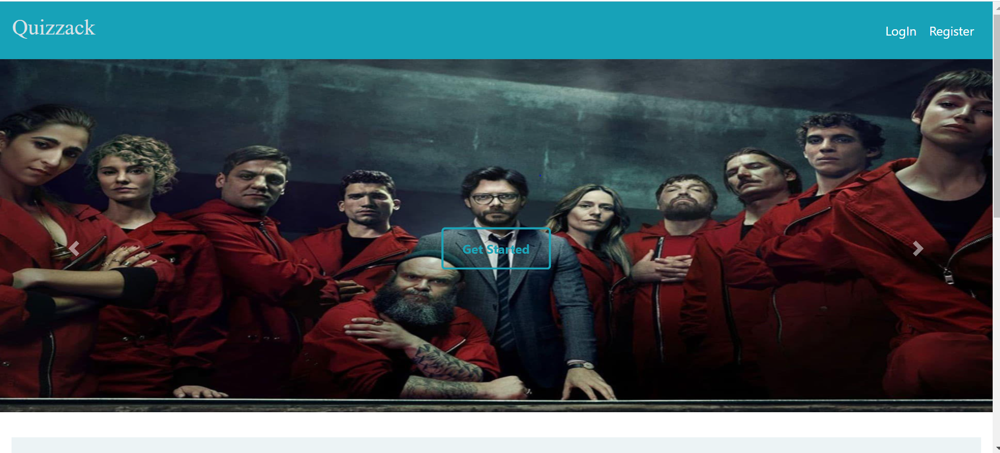
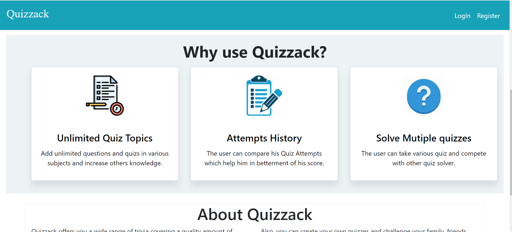
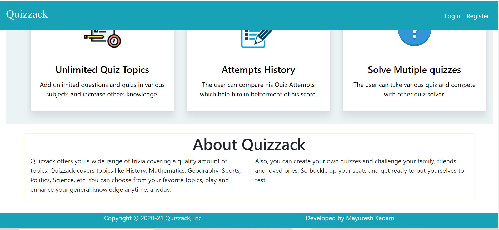
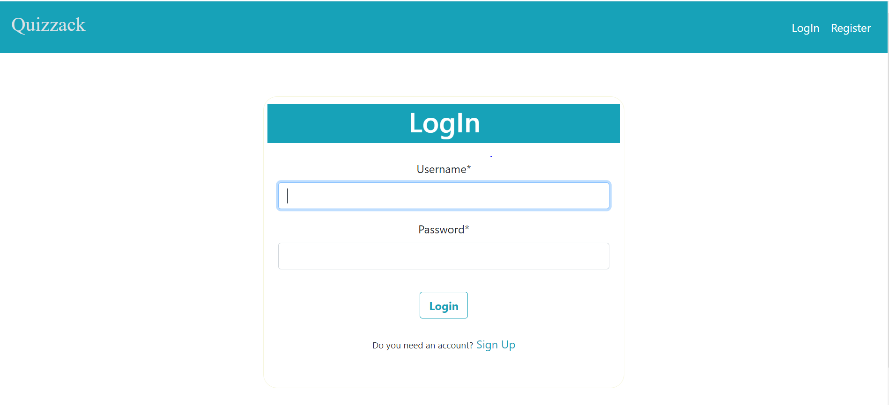
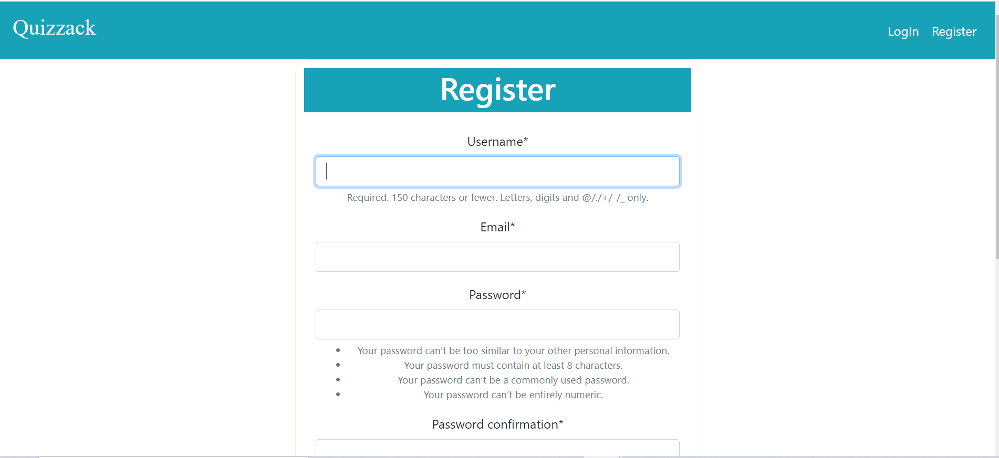
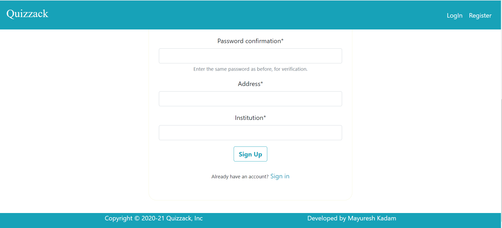
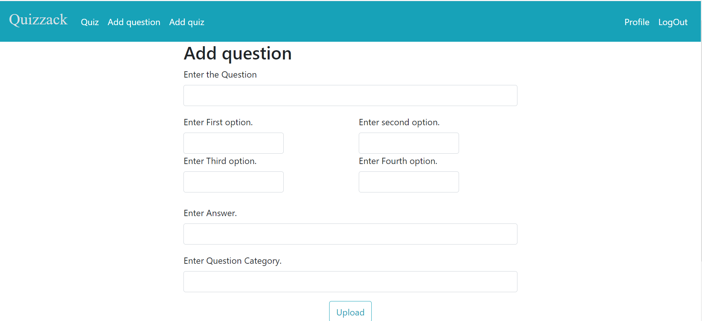
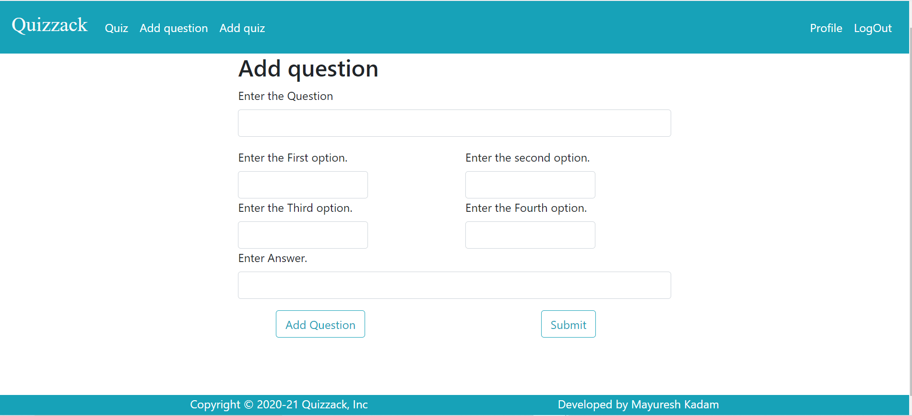
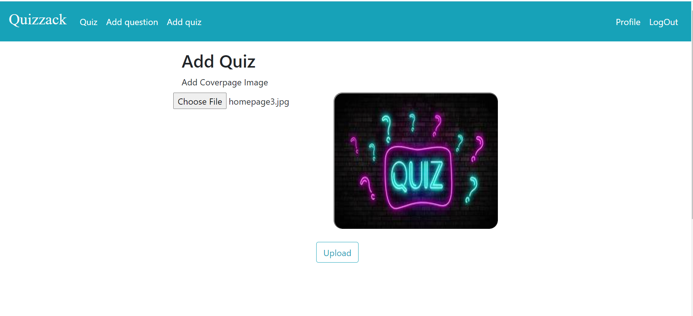
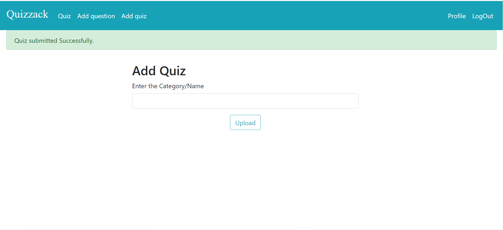
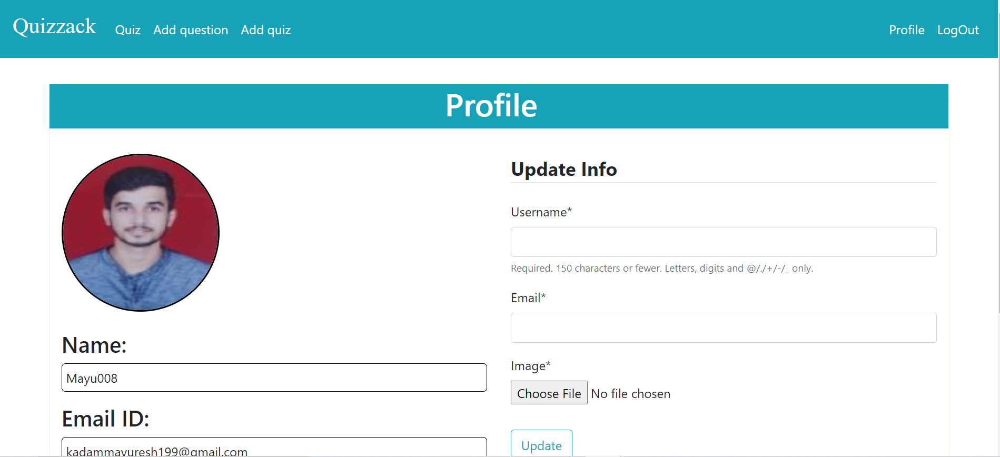
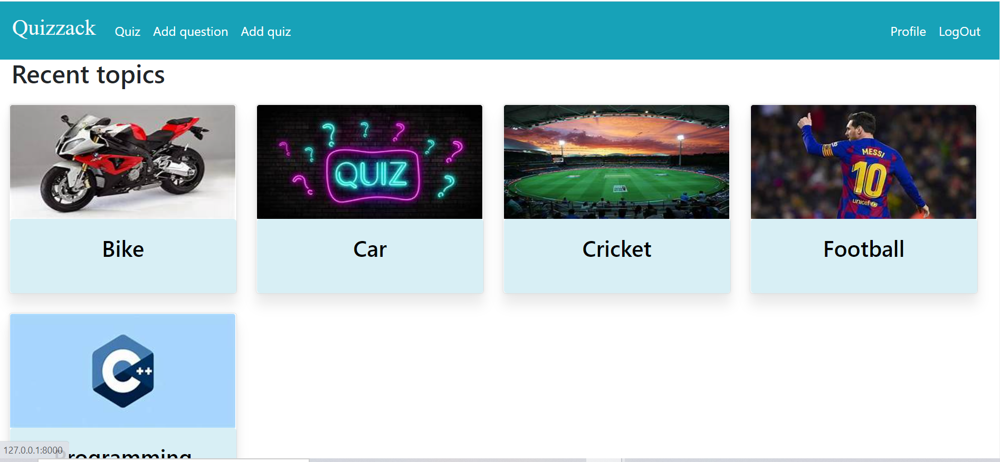
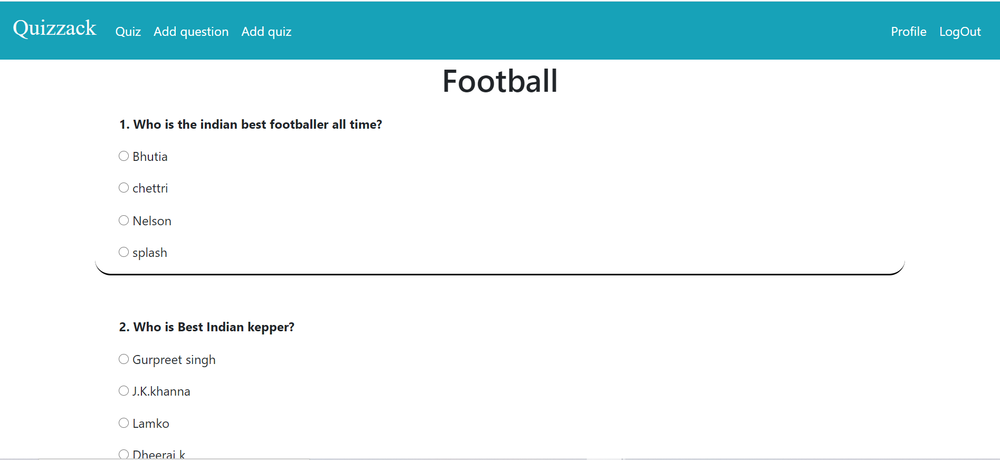
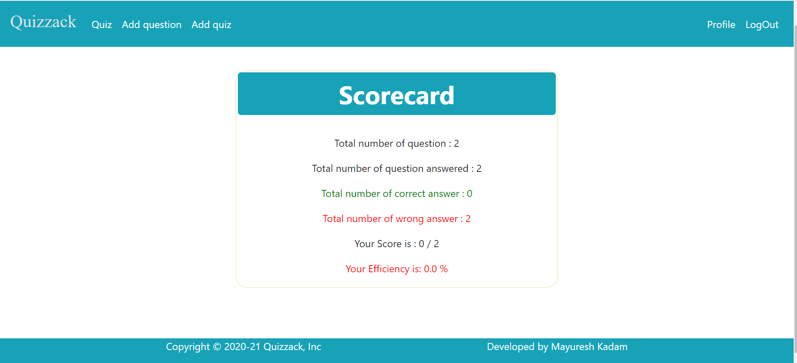
</p>

### Show some :heart: and star the repo to support the project and feel free to fix bugs
